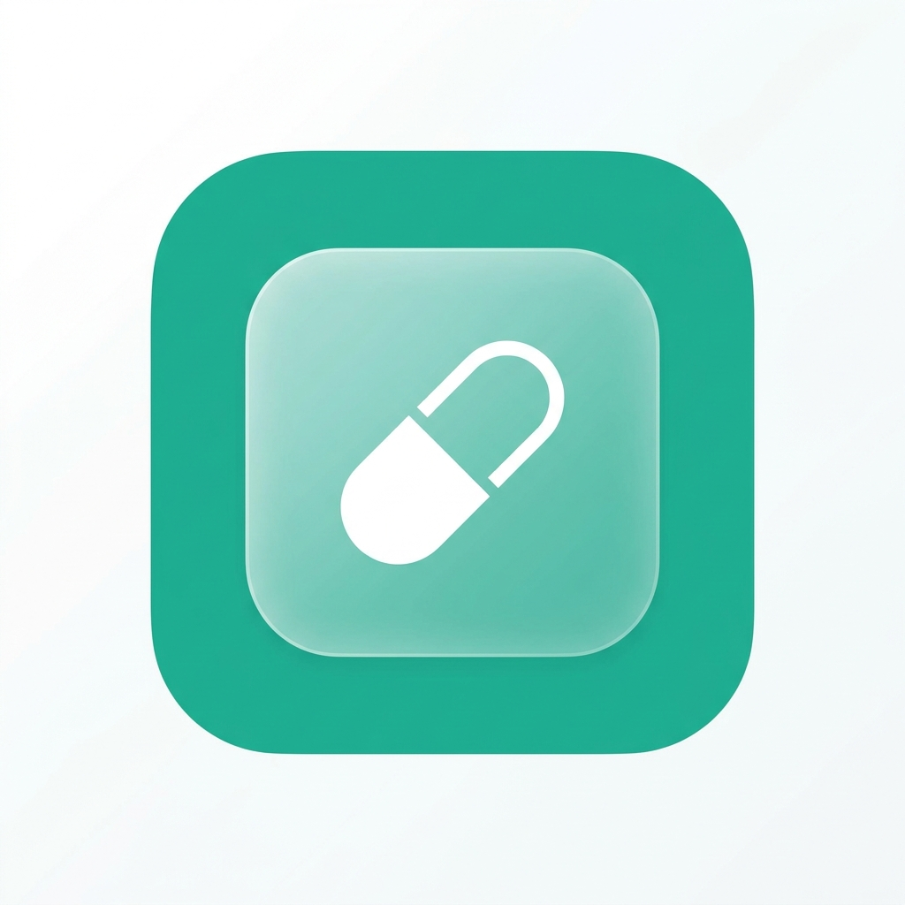

<div align="center">
  
  <h1>MediFill</h1>
  <p><strong>Your intelligent medicine management companion</strong></p>

  <p>
    <a href="https://medi-fill.netlify.app"></a>
    
    
    
    
  </p>
</div>

---

## 📱 Overview

**MediFill** is a cross-platform medicine tracker built with Expo and React Native. It helps users manage their medicines, set reminders, track stock levels, get expiry alerts, and view their daily dose schedule — all in a clean, modern UI.

> 🌐 **Web demo:** [https://medi-fill.netlify.app](https://medi-fill.netlify.app)

---

## ✨ Features

### 💊 Medicine Management
- Add medicines manually or by **scanning labels with the camera (OCR)**
- Edit all medicine details — name, dosage, frequency, quantity, expiry date, reminder times, notes
- Delete medicines with confirmation
- Visual stock progress bar with colour-coded warnings

### 🔔 Smart Alerts
- **Expiry alerts** — warns 30 days before expiry; separate "already expired" alert
- **Low stock alerts** — triggers at ≤ 20% remaining
- **Out of stock alerts** — fires when quantity reaches 0
- **Drug interaction warnings** — flags known medicine combinations
- **Dose reminder alerts** — fires within 60 minutes of scheduled time
- Slide-down **notification drawer** triggered by the bell icon

### 📅 Schedule Tab
- 7-day horizontal date strip with week navigation
- Shows only **active medicines** (non-expired, in-stock) with their reminder times
- Mark doses as taken — auto-decrements stock
- Daily **adherence bar** with percentage tracking

### 👥 Multi-Profile Support
- Add and switch between family member profiles
- Each profile has its own isolated medicines and alerts
- Auth profile syncs with Firebase; guest profiles stored locally

### 👤 Profile & Settings
- Edit display name
- Notification preferences (dose reminders, expiry, low stock, interaction warnings)
- **Do Not Disturb** — configurable start/end time with custom time picker
- Privacy settings, dark mode toggle, biometric lock toggle
- Help & Support section

### 🔐 Authentication
- Email / password sign-up and login via **Firebase Auth**
- Secure session management
- Password validation (min 8 chars, uppercase, lowercase, number, special char)

### 🗺️ Pharmacy Map
- Find nearby pharmacies in your area

---

## 🛠️ Tech Stack

| Layer | Technology |
|---|---|
| Framework | [Expo](https://expo.dev) (SDK 52) + [React Native](https://reactnative.dev) 0.76 |
| Language | TypeScript 5.3 |
| Navigation | [Expo Router](https://expo.github.io/router) (file-based) |
| Auth | Firebase Authentication |
| Database | Firebase Firestore (auth profile) + AsyncStorage (local profiles) |
| Backend API | Supabase |
| Animations | [React Native Reanimated](https://docs.swmansion.com/react-native-reanimated/) |
| Icons | [Lucide React Native](https://lucide.dev) |
| Camera / OCR | `expo-camera`, `expo-image-picker` |
| Notifications | `expo-notifications` |
| Deployment | [Netlify](https://netlify.com) (web) |

---

## 🚀 Getting Started

### Prerequisites

- [Node.js](https://nodejs.org) ≥ 18
- [Expo CLI](https://docs.expo.dev/get-started/installation/) — `npm install -g expo-cli`
- A Firebase project ([create one here](https://console.firebase.google.com))
- A Supabase project ([create one here](https://supabase.com))

### 1. Clone the repo

```bash
git clone https://github.com/kaushik6g/MediFill.git
cd MediFill
```

### 2. Install dependencies

```bash
npm install
```

### 3. Set up environment variables

Copy the example env file and fill in your own keys:

```bash
cp .env.example .env
```

Open `.env` and replace the placeholder values:

```env
# Firebase — from Firebase Console → Project Settings → General → Your apps
EXPO_PUBLIC_FIREBASE_API_KEY=your_key_here
EXPO_PUBLIC_FIREBASE_AUTH_DOMAIN=your_project.firebaseapp.com
EXPO_PUBLIC_FIREBASE_PROJECT_ID=your_project_id
EXPO_PUBLIC_FIREBASE_STORAGE_BUCKET=your_project.firebasestorage.app
EXPO_PUBLIC_FIREBASE_MESSAGING_SENDER_ID=your_sender_id
EXPO_PUBLIC_FIREBASE_APP_ID=your_app_id
EXPO_PUBLIC_FIREBASE_MEASUREMENT_ID=your_measurement_id

# Supabase — from Supabase Dashboard → Settings → API
EXPO_PUBLIC_SUPABASE_URL=https://your-project.supabase.co
EXPO_PUBLIC_SUPABASE_ANON_KEY=your_anon_key_here
```

### 4. Run the app

```bash
# Start the dev server
npm run dev

# Run on Android
npx expo run:android

# Run on iOS
npx expo run:ios

# Run on Web
npx expo start --web
```

---

## 🔐 Environment Variables

All sensitive keys are stored in `.env` (git-ignored). The app uses `EXPO_PUBLIC_` prefixed variables so they are bundled safely with Expo.

| Variable | Where to find it |
|---|---|
| `EXPO_PUBLIC_FIREBASE_API_KEY` | Firebase Console → Project Settings |
| `EXPO_PUBLIC_FIREBASE_AUTH_DOMAIN` | Firebase Console → Project Settings |
| `EXPO_PUBLIC_FIREBASE_PROJECT_ID` | Firebase Console → Project Settings |
| `EXPO_PUBLIC_FIREBASE_STORAGE_BUCKET` | Firebase Console → Project Settings |
| `EXPO_PUBLIC_FIREBASE_MESSAGING_SENDER_ID` | Firebase Console → Project Settings |
| `EXPO_PUBLIC_FIREBASE_APP_ID` | Firebase Console → Project Settings |
| `EXPO_PUBLIC_FIREBASE_MEASUREMENT_ID` | Firebase Console → Project Settings |
| `EXPO_PUBLIC_SUPABASE_URL` | Supabase → Settings → API → Project URL |
| `EXPO_PUBLIC_SUPABASE_ANON_KEY` | Supabase → Settings → API → anon/public key |

> ⚠️ **Never commit your `.env` file.** It is already listed in `.gitignore`.

---

## 📁 Project Structure

```
MediFill/
├── app/
│   ├── (tabs)/
│   │   ├── index.tsx        # Home screen
│   │   ├── add.tsx          # Add medicine (camera / manual)
│   │   ├── schedule.tsx     # Daily dose schedule
│   │   ├── pharmacy.tsx     # Nearby pharmacies map
│   │   └── profile.tsx      # Profile & settings
│   ├── auth.tsx             # Login / sign-up
│   └── _layout.tsx          # Root layout
├── components/
│   ├── MedicineCard.tsx     # Card with full edit modal
│   ├── TimePickerModal.tsx  # Custom 12/24h time picker
│   └── DateTimePicker.tsx   # Cross-platform date picker
├── context/
│   ├── AuthContext.tsx      # Firebase auth state
│   └── MedicineContext.tsx  # Medicine & alert state
├── config/
│   ├── firebase.ts          # Firebase init (reads from env)
│   └── supabase.ts          # Supabase client (reads from env)
├── constants/
│   ├── theme.ts             # Colors, spacing, typography
│   ├── interactions.ts      # Drug interaction data
│   └── pharmacies.ts        # Pharmacy location data
├── services/
│   ├── firestoreSync.ts     # Firebase Firestore sync
│   ├── notificationService.ts
│   └── ocrService.ts        # Camera OCR label reading
├── .env.example             # Env variable template (safe to commit)
├── .gitignore               # Excludes .env, secrets, node_modules
├── netlify.toml             # Netlify build + redirect config
└── app.json                 # Expo app configuration
```

---

## 🔒 Security

- All API keys and secrets are stored in `.env` (git-ignored)
- Firebase service files (`google-services.json`, `GoogleService-Info.plist`) are git-ignored
- Only `.env.example` with placeholder values is committed
- For production, set env vars in your hosting platform's dashboard (Netlify, EAS, etc.)

---

## 📸 Screenshots

> Running on web at [medi-fill.netlify.app](https://medi-fill.netlify.app)

| Home | Schedule | Profile |
|:---:|:---:|:---:|
| Stats • Medicine list • Alert drawer | 7-day strip • Dose timeline | Settings • DND • Multi-profile |

---

## 🤝 Contributing

1. Fork the repo
2. Create a branch: `git checkout -b feature/your-feature`
3. Copy `.env.example` to `.env` and fill in your own keys
4. Make your changes and commit: `git commit -m "feat: your feature"`
5. Push and open a Pull Request

---

## 📄 License

This project is for educational and personal use. All rights reserved © 2025 MediFill.

---

<div align="center">
  <p>Built with ❤️ using Expo + React Native</p>
  <a href="https://medi-fill.netlify.app">🌐 Live Demo</a> · 
  <a href="https://github.com/kaushik6g/MediFill/issues">🐛 Report Bug</a> · 
  <a href="https://github.com/kaushik6g/MediFill/issues">✨ Request Feature</a>
</div>
